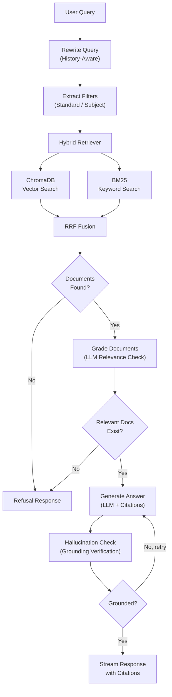

# GSSTB Scholar - Agentic RAG for Gujarat State Board Textbooks

A production-grade conversational RAG (Retrieval-Augmented Generation) application that answers student questions strictly from official Gujarat State Board (GSSTB) textbook PDFs (Std 9-12) with page-accurate citations, hallucination guardrails, and multi-turn conversation support.

Built with **LangChain**, **LangGraph**, **ChromaDB**, **FastAPI**, and **React**.

## Architecture

The system uses a **LangGraph stateful agent** to orchestrate a self-correcting RAG pipeline:



## Features

- **Agentic RAG with LangGraph** - Self-correcting pipeline with document grading and hallucination guardrails
- **Hybrid Retrieval** - Combines ChromaDB vector search with BM25 keyword search via Reciprocal Rank Fusion (RRF)
- **Cross-Encoder Reranking** - Optional reranking with ms-marco-MiniLM-L-6-v2 for improved precision
- **Conversational Memory** - History-aware query rewriting resolves pronouns and contextual references across turns
- **Auto Metadata Filtering** - LLM-powered filter extraction auto-detects standard (Std 9-12) and subject from queries
- **Page-Accurate Citations** - Every answer includes textbook name, page numbers, and relevant text snippets
- **Strict Grounding** - Refuses to answer from outside the textbook corpus with a standard refusal message
- **PDF Ingestion Pipeline** - Supports digital text, structured tables, and OCR fallback for scanned pages
- **Real-time Streaming** - SSE-based token streaming for responsive chat experience
- **Firebase Authentication** - Secure user authentication with Google sign-in

## Tech Stack

| Layer | Technology |
|---|---|
| **Agent Framework** | LangGraph (stateful workflow), LangChain (LCEL chains) |
| **LLM** | Groq (via langchain-groq) |
| **Vector Store** | ChromaDB (cosine similarity, all-MiniLM-L6-v2 embeddings) |
| **Keyword Search** | BM25 (rank-bm25) |
| **Fusion** | Reciprocal Rank Fusion (RRF) |
| **Reranking** | Cross-Encoder (ms-marco-MiniLM-L-6-v2) |
| **Text Splitting** | LangChain RecursiveCharacterTextSplitter |
| **Backend** | FastAPI, SSE streaming, SQLite |
| **Frontend** | React, Vite, Firebase Auth |
| **PDF Processing** | PyMuPDF, Tesseract/EasyOCR |
| **Auth** | Firebase (JWT verification) |
| **Containerization** | Docker, Docker Compose |

## Project Structure

```
backend/
  app/
    chains/              # LangChain components
      llm.py             # ChatGroq LLM wrapper
      prompts.py         # ChatPromptTemplate definitions
      retriever.py       # Custom hybrid retriever (BaseRetriever)
    graph/               # LangGraph agent
      state.py           # TypedDict state definition
      nodes.py           # Node functions (rewrite, retrieve, grade, generate, hallucinate-check)
      rag_graph.py       # Graph compilation and runner
    retrieval/           # Search infrastructure
      vector_store.py    # ChromaDB operations
      bm25_store.py      # BM25 index with persistence
      hybrid.py          # Hybrid search with RRF fusion
      reranker.py        # Cross-encoder reranking
      query_router.py    # Query routing utilities
    ingest/              # PDF ingestion pipeline
      pdf_extractor.py   # PyMuPDF + OCR text extraction
      chunker.py         # LangChain text splitting
      metadata.py        # Filename metadata parsing
      service.py         # Ingestion orchestration
    chat/                # Chat API
      router.py          # FastAPI SSE endpoint
      service.py         # LangGraph agent orchestration
    sessions/            # Session management
    auth/                # Firebase JWT auth
    documents/           # Document management API
    config.py            # Settings (Pydantic)
    database.py          # SQLite setup
    main.py              # FastAPI app
frontend/
  src/
    components/          # React components
    pages/               # Page views
    api/                 # API client
    contexts/            # Auth context
```

## Getting Started

### Prerequisites

- Python 3.10+
- Node.js 18+
- A Groq API key ([console.groq.com](https://console.groq.com))
- A Firebase project (for authentication)

### 1. Clone the repository

```bash
git clone https://github.com/YOUR_USERNAME/gsstb-scholar.git
cd gsstb-scholar
```

### 2. Backend setup

```bash
cd backend
python -m venv venv
source venv/bin/activate   # On Windows: venv\Scripts\activate
pip install -r requirements.txt
```

Create a `.env` file in the `backend/` directory:

```env
GROQ_API_KEY=your_groq_api_key_here
FIREBASE_PROJECT_ID=your_firebase_project_id
```

Start the backend:

```bash
uvicorn app.main:app --reload --port 8001
```

### 3. Frontend setup

```bash
cd frontend
npm install
npm run dev
```

The frontend runs on `http://localhost:5173` and the backend on `http://localhost:8001`.

### 4. Docker (optional)

```bash
docker-compose up --build
```

## API Endpoints

| Method | Endpoint | Description |
|---|---|---|
| POST | `/api/chat/stream` | Send a message and receive SSE-streamed response with citations |
| POST | `/api/ingest/upload` | Upload a textbook PDF for ingestion |
| GET | `/api/documents/` | List all ingested documents |
| POST | `/api/sessions/` | Create a new chat session |
| GET | `/api/sessions/` | List user's chat sessions |
| GET | `/api/sessions/{id}/messages` | Get messages for a session |
| GET | `/api/health` | Health check |

## How It Works

1. **PDF Ingestion** - Textbook PDFs are uploaded, text is extracted (with OCR fallback for scanned pages), and split into chunks using LangChain's `RecursiveCharacterTextSplitter`. Chunks are indexed in both ChromaDB (vector) and BM25 (keyword) stores.

2. **Query Rewriting** - When a user sends a follow-up question, LangChain's history-aware chain rewrites it into a standalone query by resolving pronouns and contextual references.

3. **Filter Extraction** - An LLM extracts metadata filters (standard, subject) from the query to narrow the search scope.

4. **Hybrid Retrieval** - The query is searched against both ChromaDB (semantic similarity) and BM25 (keyword matching). Results are fused using Reciprocal Rank Fusion (RRF) and optionally reranked with a cross-encoder.

5. **Document Grading** - An LLM grades each retrieved chunk for relevance to the question. Irrelevant chunks are filtered out.

6. **Grounded Generation** - The LLM generates an answer strictly from the relevant chunks, with page-accurate citations.

7. **Hallucination Check** - A separate LLM call verifies the answer is fully grounded in the source documents. If not, the generation is retried.

8. **Streaming Response** - The final answer is streamed to the frontend via SSE with citations attached at the end.

## License

MIT
