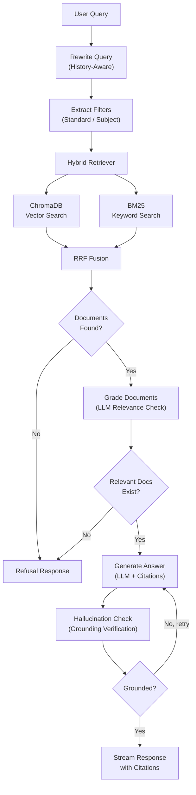

# GSSTB Scholar - Agentic RAG for Gujarat State Board Textbooks

[](https://python.org)
[](https://python.langchain.com)
[](https://langchain-ai.github.io/langgraph/)
[](https://fastapi.tiangolo.com)
[](https://react.dev)
[](LICENSE)
[](https://gsstb-scholar.onrender.com/)

> **Live Demo:** [https://gsstb-scholar.onrender.com](https://gsstb-scholar.onrender.com/)

A production-grade **Agentic RAG** (Retrieval-Augmented Generation) application that answers student questions strictly from official Gujarat State Board (GSSTB) textbook PDFs (Std 9-12) with page-accurate citations, hallucination guardrails, and multi-turn conversation support.

Built with **LangChain**, **LangGraph**, **ChromaDB**, **FastAPI**, and **React**.

## Why This Project?

Students preparing for Gujarat State Board exams (Std 9-12) often struggle to find specific answers buried across hundreds of textbook pages. GSSTB Scholar solves this by letting students **ask questions in natural language** and getting **grounded, cited answers** directly from the official textbooks, with a self-correcting AI pipeline that refuses to hallucinate.

## Architecture

The system uses a **LangGraph stateful agent** to orchestrate a self-correcting RAG pipeline with 6 specialized nodes:



## Key Features

- **Agentic RAG with LangGraph** - Self-correcting pipeline with document grading and hallucination guardrails. The agent retries generation if the answer is not grounded in source documents.
- **Hybrid Retrieval** - Combines ChromaDB vector search (semantic similarity) with BM25 keyword search via Reciprocal Rank Fusion (RRF) for better recall than either method alone.
- **Cross-Encoder Reranking** - Optional second-stage reranking with ms-marco-MiniLM-L-6-v2 for improved precision on the top results.
- **Conversational Memory** - History-aware query rewriting resolves pronouns ("it", "them", "this") and contextual references across multi-turn conversations.
- **Auto Metadata Filtering** - LLM-powered filter extraction auto-detects standard (Std 9-12) and subject from queries, narrowing the search space before retrieval.
- **Page-Accurate Citations** - Every answer includes textbook name, page numbers, and relevant text snippets so students can verify and read further.
- **Strict Grounding** - Refuses to answer questions that cannot be answered from the textbook corpus, preventing misinformation.
- **PDF Ingestion Pipeline** - Supports digital text extraction, structured table extraction (Markdown), and OCR fallback (Tesseract/EasyOCR) for scanned pages.
- **Real-time Streaming** - SSE-based token streaming for a responsive, ChatGPT-like chat experience.
- **Firebase Authentication** - Secure user authentication with Google sign-in.

## Tech Stack

| Layer | Technology |
|---|---|
| **Agent Framework** | LangGraph (stateful workflow with conditional routing), LangChain (LCEL chains) |
| **LLM** | Groq (via langchain-groq) |
| **Embeddings** | Sentence-Transformers (all-MiniLM-L6-v2) |
| **Vector Store** | ChromaDB (cosine similarity) |
| **Keyword Search** | BM25 (rank-bm25, with custom tokenizer and stopword removal) |
| **Retrieval Fusion** | Reciprocal Rank Fusion (RRF) combining vector and keyword results |
| **Reranking** | Cross-Encoder (ms-marco-MiniLM-L-6-v2) |
| **Text Splitting** | LangChain RecursiveCharacterTextSplitter (sentence-aware, recursive) |
| **Backend** | Python, FastAPI, SSE streaming, SQLite (aiosqlite) |
| **Frontend** | React 18, Vite, TailwindCSS, Firebase Auth |
| **PDF Processing** | PyMuPDF (text + tables), Tesseract/EasyOCR (OCR fallback) |
| **Auth** | Firebase (JWT verification via PyJWT) |
| **Containerization** | Docker, Docker Compose |

## Project Structure

```
backend/
  app/
    chains/              # LangChain components
      llm.py             # ChatGroq LLM wrapper (get_llm, get_structured_llm)
      prompts.py         # ChatPromptTemplate definitions (5 specialized prompts)
      retriever.py       # Custom HybridRetriever extending BaseRetriever
    graph/               # LangGraph agentic workflow
      state.py           # TypedDict state definition (11 fields)
      nodes.py           # 6 node functions with conditional routing
      rag_graph.py       # StateGraph compilation and async runner
    retrieval/           # Search infrastructure
      vector_store.py    # ChromaDB vector store (upsert, query, delete)
      bm25_store.py      # BM25 index with pickle persistence
      hybrid.py          # Hybrid search with Reciprocal Rank Fusion
      reranker.py        # Cross-encoder reranking (ms-marco-MiniLM-L-6-v2)
      query_router.py    # Query routing utilities
    ingest/              # PDF ingestion pipeline
      pdf_extractor.py   # PyMuPDF text extraction + OCR fallback
      chunker.py         # LangChain RecursiveCharacterTextSplitter
      metadata.py        # Filename-based metadata parsing
      service.py         # Background ingestion orchestration
    chat/                # Chat API
      router.py          # FastAPI SSE endpoint (/api/chat/stream)
      service.py         # LangGraph agent orchestration + SSE streaming
    sessions/            # Session and message management (SQLite)
    auth/                # Firebase JWT token verification
    documents/           # Document management API
    config.py            # Pydantic Settings (env-based configuration)
    database.py          # SQLite schema and connection setup
    main.py              # FastAPI application entry point
frontend/
  src/
    components/          # React UI components
    pages/               # Page views (Chat, Documents, Login)
    api/                 # Backend API client
    contexts/            # Auth context provider
```

## Getting Started

### Prerequisites

- Python 3.10+
- Node.js 18+
- A Groq API key ([console.groq.com](https://console.groq.com))
- A Firebase project (for authentication)

### 1. Clone the repository

```bash
git clone https://github.com/Kush5699/textbook-rag-langgraph.git
cd textbook-rag-langgraph
```

### 2. Backend setup

```bash
cd backend
python -m venv venv
source venv/bin/activate   # On Windows: venv\Scripts\activate
pip install -r requirements.txt
```

Create a `.env` file in the `backend/` directory:

```env
GROQ_API_KEY=your_groq_api_key_here
FIREBASE_PROJECT_ID=your_firebase_project_id
```

Start the backend:

```bash
uvicorn app.main:app --reload --port 8001
```

### 3. Frontend setup

```bash
cd frontend
npm install
npm run dev
```

The frontend runs on `http://localhost:5173` and the backend API on `http://localhost:8001`.

### 4. Docker (optional)

```bash
docker-compose up --build
```

## API Endpoints

| Method | Endpoint | Description |
|---|---|---|
| POST | `/api/chat/stream` | Send a message and receive SSE-streamed response with citations |
| POST | `/api/ingest/upload` | Upload a textbook PDF for ingestion |
| GET | `/api/documents/` | List all ingested documents |
| POST | `/api/sessions/` | Create a new chat session |
| GET | `/api/sessions/` | List user's chat sessions |
| GET | `/api/sessions/{id}/messages` | Get messages for a session |
| DELETE | `/api/sessions/{id}` | Delete a session and its messages |
| GET | `/api/health` | Health check |

## How It Works

### 1. PDF Ingestion
Textbook PDFs are uploaded via the API. Text is extracted page-by-page using PyMuPDF, with structured table extraction to Markdown and OCR fallback (Tesseract or EasyOCR) for scanned pages. Text is split into chunks using LangChain's `RecursiveCharacterTextSplitter` with sentence-aware separators. Each chunk is dual-indexed into ChromaDB (vector embeddings) and a BM25 store (keyword index) with metadata (textbook name, page number, standard, subject).

### 2. Query Rewriting (LangGraph Node)
When a user sends a follow-up question, the `rewrite_query` node uses a LangChain LCEL chain to rewrite it into a standalone, keyword-rich search query by resolving pronouns and conversational references from chat history.

### 3. Filter Extraction (LangGraph Node)
The `extract_filters` node uses an LLM to parse the query and extract metadata filters (standard, subject), narrowing the search space before retrieval.

### 4. Hybrid Retrieval (LangGraph Node)
The `retrieve` node runs the query against both ChromaDB (semantic vector search) and BM25 (keyword matching) through a custom `HybridRetriever` (extending LangChain's `BaseRetriever`). Results from both are fused using Reciprocal Rank Fusion (RRF) and optionally reranked with a cross-encoder model.

### 5. Document Grading (LangGraph Node)
The `grade_documents` node uses an LLM to grade each retrieved chunk for relevance. Irrelevant chunks are filtered out. If no relevant chunks remain, the agent routes to a refusal response.

### 6. Grounded Generation (LangGraph Node)
The `generate` node builds a context string from relevant chunks and generates a grounded answer using a LangChain LCEL chain (`ChatPromptTemplate | ChatGroq | StrOutputParser`). Page-accurate citations are extracted from document metadata.

### 7. Hallucination Check (LangGraph Node)
The `check_hallucination` node verifies that every claim in the generated answer can be traced back to the source documents. If the answer is not grounded, the agent conditionally routes back to the `generate` node for a retry (max 1 retry).

### 8. Streaming Response
The final answer is streamed to the React frontend via Server-Sent Events (SSE) with citations attached in the final event.

## License

MIT
