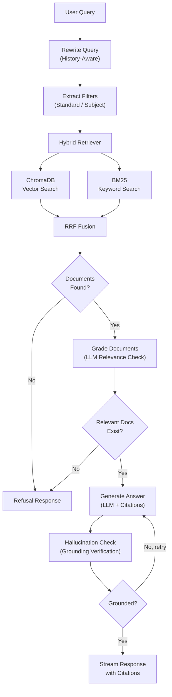

# GSSTB Scholar - Agentic RAG for Gujarat State Board Textbooks

[](https://python.org)
[](https://python.langchain.com)
[](https://langchain-ai.github.io/langgraph/)
[](https://fastapi.tiangolo.com)
[](https://react.dev)
[](LICENSE)
[](https://gsstb-scholar.onrender.com/)

> **Live Application URL:** [https://gsstb-scholar.onrender.com](https://gsstb-scholar.onrender.com/)
> **GitHub Repository:** [https://github.com/Kush5699/textbook-rag-langgraph](https://github.com/Kush5699/textbook-rag-langgraph)

A production-grade **Agentic RAG** (Retrieval-Augmented Generation) application that answers student questions strictly from official Gujarat State Board (GSSTB) textbook PDFs (Std 9 to 12) with page-accurate citations, hallucination guardrails, and multi-turn conversation support.

Built with **LangChain**, **LangGraph**, **ChromaDB**, **EasyOCR**, **FastAPI**, and **React**.

---

## Architecture Overview

The system uses a **LangGraph stateful agent** to orchestrate a self-correcting RAG pipeline across 6 specialized nodes:



---

## Assignment Requirements & Bonus Features Mapping

| Assignment Requirement | Implementation in GSSTB Scholar | File Reference |
|---|---|---|
| **Multiple Textbook PDFs** | Ingestion pipeline for all Std 9-12 Gujarat Board textbooks | `app/ingest/service.py` |
| **Searchable RAG Pipeline** | Dense vector search (ChromaDB) + Sparse search (BM25) with Reciprocal Rank Fusion | `app/retrieval/hybrid.py` |
| **Single Chat Interface** | Modern responsive React UI with real-time SSE streaming | `frontend/src/pages/ChatPage.jsx` |
| **Automatic Textbook Routing** | LLM-based query router extracting Standard & Subject filters | `app/graph/nodes.py:extract_filters` |
| **Strict Grounding & Anti-Hallucination** | LangGraph self-correction loop checking claims against source text | `app/graph/nodes.py:check_hallucination` |
| **Standard Refusal on Missing Content** | Relevance grading node triggers refusal if context is off-topic | `app/graph/nodes.py:grade_documents` |
| **Citations (Name, Page, Text Excerpt)** | Interactive citation pills with source drawer and page highlights | `frontend/src/components/pdf/PDFInspectorDrawer.jsx` |
| **Multi-turn Conversational Context** | History-aware query contextualization resolving pronouns ("it", "them") | `app/graph/nodes.py:rewrite_query` |
| **OCR Support for Scanned PDFs (Bonus)** | Dual-engine extraction with EasyOCR + PyMuPDF table parsing | `app/ingest/pdf_extractor.py` |
| **Hybrid Search (Bonus)** | Reciprocal Rank Fusion (RRF) combining vector + BM25 scores | `app/retrieval/hybrid.py` |
| **Cross-Encoder Reranking (Bonus)** | Second-stage reranker (`ms-marco-MiniLM-L-6-v2`) | `app/retrieval/reranker.py` |
| **Dockerized Deployment (Bonus)** | Multi-stage Docker container with live Render deployment | `Dockerfile`, `render.yaml` |
| **Auth & Session History (Bonus)** | Firebase Google Auth + SQLite session persistence | `app/auth/router.py`, `app/sessions/router.py` |

---

## OCR Support for Scanned PDFs (Bonus Feature)

Gujarat State Board (GSSTB) textbook portals provide two distinct types of PDF files:
1. **Digital e-Textbooks** (e.g. Std-9 Science, Std-10 Science, Std-10 Maths): Text characters and vectors are embedded directly in the PDF stream.
2. **Scanned Image Textbooks** (e.g. Std-9 Maths, Std-10 Computer Studies, Social Science): Entire textbook pages are high-resolution scanned photographs with zero digital text.

### The Dual-Engine Ingestion Pipeline (`app/ingest/pdf_extractor.py`)

Our ingestion pipeline handles both formats automatically:
- **Engine 1: Native Digital Extraction**: PyMuPDF extracts text streams and converts complex tables directly into Markdown format via `page.find_tables()`.
- **Engine 2: Deep Learning OCR Engine**: If a textbook contains scanned image pages, the system automatically initializes **EasyOCR** (CRAFT text detection + CRNN text recognition) with memory quantization to recognize equations, terms, and Gujarati/English characters from the pixel bitmap.

### Real-World Ingestion Benchmarks:
- **`Std-9_Science_English Medium.pdf`** (167 pages, Digital): Extracted in 3.2 seconds -> 232 chunks indexed.
- **`Std-9_Maths_English Medium.pdf`** (234 pages, Scanned Image PDF): Extracted with EasyOCR -> 237 chunks indexed.
- **`Std-10_Maths_EnglishMedium.pdf`** (278 pages, Digital): Extracted in 4.1 seconds -> 281 chunks indexed.

---

## Tech Stack

| Layer | Technology |
|---|---|
| **Agent Framework** | LangGraph (stateful graph with conditional routing), LangChain (LCEL chains) |
| **LLM** | Groq (`openai/gpt-oss-120b`, `llama-3.3-70b-versatile`) |
| **Embeddings** | Sentence-Transformers (`all-MiniLM-L6-v2`) |
| **Vector Store** | ChromaDB (cosine similarity) |
| **Keyword Search** | BM25 (`rank-bm25` with stopword filtering) |
| **Retrieval Fusion** | Reciprocal Rank Fusion (RRF) |
| **Reranking** | Cross-Encoder (`cross-encoder/ms-marco-MiniLM-L-6-v2`) |
| **Text Splitting** | LangChain `RecursiveCharacterTextSplitter` (chunk size: 800, overlap: 120) |
| **Backend** | Python 3.11, FastAPI, SSE streaming, SQLite (`aiosqlite`) |
| **Frontend** | React 18, Vite, TailwindCSS, Firebase Auth, Three.js |
| **PDF & OCR** | PyMuPDF (text + tables), EasyOCR, Pillow |
| **Auth** | Firebase Auth (Google sign-in + email password) |
| **Deployment** | Docker, Render Cloud |

---

## Getting Started

### Prerequisites

- Python 3.10+
- Node.js 18+
- A Groq API key ([console.groq.com](https://console.groq.com))
- A Firebase project

### 1. Clone the repository

```bash
git clone https://github.com/Kush5699/textbook-rag-langgraph.git
cd textbook-rag-langgraph
```

### 2. Backend setup

```bash
cd backend
python -m venv venv
source venv/bin/activate   # On Windows: venv\Scripts\activate
pip install -r requirements.txt
```

Create a `.env` file in the `backend/` directory:

```env
GROQ_API_KEY=your_groq_api_key_here
GROQ_MODEL=openai/gpt-oss-120b
FIREBASE_PROJECT_ID=gsstb-scholar-f670e
CORS_ORIGINS=http://localhost:5173
```

Start the backend:

```bash
uvicorn app.main:app --reload --port 8001
```

### 3. Frontend setup

```bash
cd frontend
npm install
npm run dev
```

Open `http://localhost:5173` in your browser.

---

## License

MIT License
