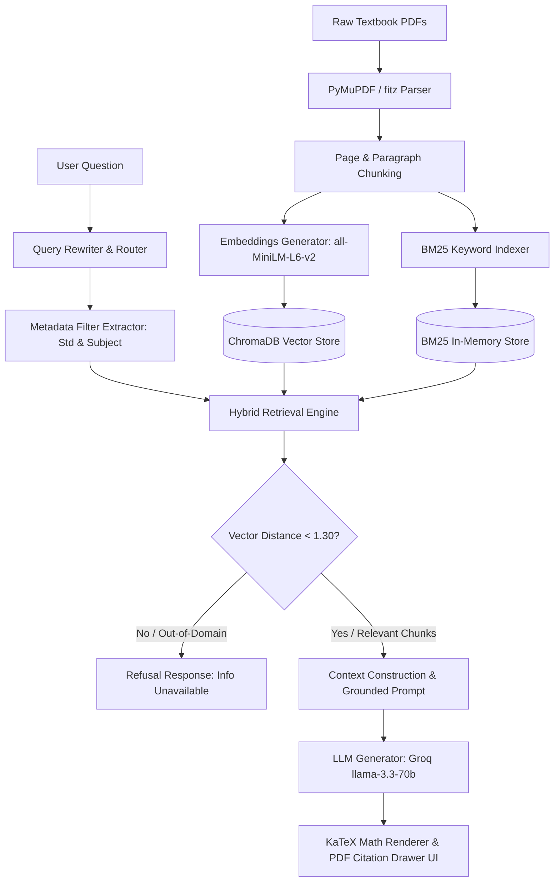

# Complete RAG Pipeline & System Architecture Blueprint

This document details the complete end-to-end pipeline, system architecture, data flow, and implementation steps for building a textbook Retrieval-Augmented Generation (RAG) system from scratch.

---

## 1. System Architecture Overview

---

## 2. Step-by-Step Pipeline Specifications

### Step 1: Data Ingestion & PDF Extraction
- **PDF Engine**: PyMuPDF (`fitz`) to preserve clean Unicode text decoding from custom PDF fonts (`Identity-H`).
- **Standard Normalization**: Convert raw standard labels into standard metadata tags (`Std 9` -> `Std_09`, `Std 10` -> `Std_10`).
- **Chunking Strategy**: 
  - Page-level or 500-token chunk windows with 50-token overlap.
  - Attach rich metadata to every chunk: `textbook_name`, `page_number`, `standard`, `subject`.

### Step 2: Vector & Keyword Indexing
- **Vector Store**: ChromaDB (`chromadb`) persistent database.
- **Embedding Model**: `sentence-transformers/all-MiniLM-L6-v2` (384-dimensional dense vectors).
- **BM25 Keyword Store**: `rank_bm25` (BM25Okapi) with custom regex tokenization and English stop-word filtering (`who`, `what`, `the`, `is`, `a`).

### Step 3: Query Routing & Standard Extraction
- Analyze incoming user questions to extract intended academic standards (`Std_09` to `Std_12`) and subjects (`Maths`, `Science`, `Social Science`).
- Apply exact metadata filters during vector query execution to maximize context precision.

### Step 4: Hybrid Retrieval & Relevance Guardrails
- **Hybrid Fusion**: Combine top-K vector search results with top-K BM25 keyword matches.
- **Distance Thresholding**: Filter out vector search matches with cosine distance `>= 1.30`.
- **Out-of-Domain Detection**: If 0 chunks satisfy distance `< 1.30`, immediately bypass LLM generation and output exact refusal string.

### Step 5: Grounded Prompting & Generation
- **System Prompt**: Enforce strict grounding. Prevent hallucination or meta-phrases ("According to the textbook").
- **Refusal Requirement**: Return `"The requested information is unavailable in the provided Gujarat State Board textbooks."` with 0 citation pills for out-of-domain questions.
- **Math Formatting**: Instruct LLM to output standard LaTeX math (`$ ... $` for inline, `$$ ... $$` for centered display blocks).

### Step 6: Frontend UI & Interactive PDF Page Viewer
- **UI Framework**: React + Vite with dark minimalist styling.
- **Math Engine**: `remark-math` + `rehype-katex` + `katex` for crisp mathematical equation rendering.
- **PDF Page Viewer**: PDF.js canvas viewer with text layer highlights overlay that opens in a draggable side drawer.
- **Smart Paste**: Auto-expand input box up to 200px max-height and collapse vertical math extractions on paste.

---

## 3. Technology Stack Summary

| Layer | Recommended Technology |
| :--- | :--- |
| **PDF Extraction** | PyMuPDF (`fitz`) |
| **Vector Database** | ChromaDB (`chromadb`) |
| **Embedding Model** | HuggingFace `sentence-transformers/all-MiniLM-L6-v2` |
| **Keyword Search** | `rank_bm25` (BM25Okapi) |
| **LLM Provider** | Groq API (`llama-3.3-70b-versatile`) or OpenAI API |
| **Backend API** | FastAPI + `sse-starlette` (Server-Sent Events) |
| **Frontend Framework** | React 18 + Vite |
| **Math Renderer** | KaTeX (`remark-math`, `rehype-katex`, `katex`) |
| **PDF Canvas Viewer** | `pdfjs-dist` |

---

## 4. Key Lessons Learned

1. **Relevance Thresholding**: Vector distance thresholding (e.g. cosine distance `< 1.30`) is critical to prevent LLM hallucinations on out-of-domain queries.
2. **Stop-Word Filtering in BM25**: Excluding common unigrams (`who`, `the`, `won`) prevents false BM25 keyword matches on unrelated textbook pages.
3. **KaTeX Integration**: Using `remark-math` + `rehype-katex` provides native LaTeX math rendering for fractions, powers, and proofs.
4. **PDF Font Handling**: Sanitizing raw clipboard pastes prevents CID font glyph corruption (`!"" # $%) when copying directly from browser PDF viewports.
